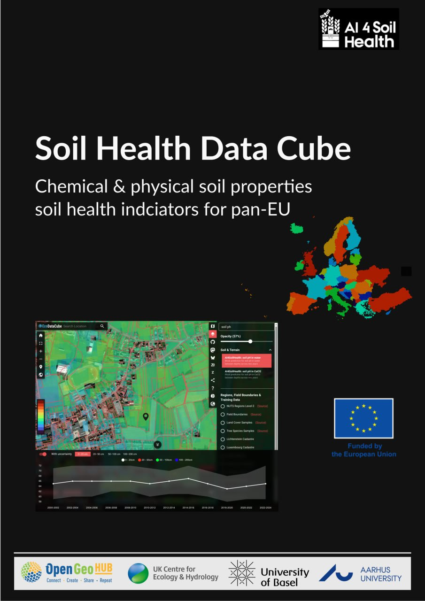

# Soil Health Data Cube for pan-EU

This repository hosts the source code of the
book *Soil Health Data Cube for pan-EU (SHDC4EU)*.

[](https://shdc.ai4soilhealth.eu)

## Acknowledgments

**[AI4SoilHealth.eu](https://AI4SoilHealth.eu)** project has received funding from the European Union's Horizon Europe research an innovation programme under grant agreement **[No. 101086179](https://cordis.europa.eu/project/id/101086179)**.


## Data folder
To make the code not show local paths, the direcotry containing the data was
linked with a symlink to a relative path

```sh
mkdir example_data
ln -s /mnt/lacus/example_soil_harmo/* example_data/
```